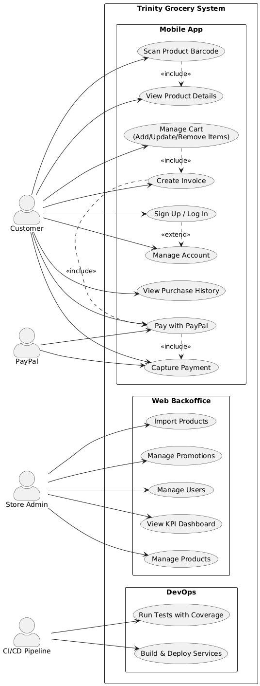

# Trinity Grocery System

A full-stack grocery e-commerce platform with a **Flask REST API** backend, **React** web frontend, and **Expo React Native** mobile app. Features include JWT authentication with refresh tokens, PayPal payment integration, Algolia-powered search and recommendations, admin dashboard with KPIs, and automated CI/CD deployment to AWS EC2.

---

## Table of Contents

- [Architecture Overview](#architecture-overview)
- [Tech Stack](#tech-stack)
- [Project Structure](#project-structure)
- [Getting Started](#getting-started)
  - [Prerequisites](#prerequisites)
  - [Backend Setup](#backend-setup)
  - [Frontend Setup](#frontend-setup)
  - [Mobile App Setup](#mobile-app-setup)
- [Environment Variables](#environment-variables)
- [API Reference](#api-reference)
- [Database Schema](#database-schema)
- [Authentication](#authentication)
- [Payment Integration](#payment-integration)
- [Algolia Search & Recommendations](#algolia-search--recommendations)
- [Admin Features](#admin-features)
- [Docker & Deployment](#docker--deployment)
- [CI/CD Pipeline](#cicd-pipeline)
- [Utility Scripts](#utility-scripts)
- [Diagrams](#diagrams)
- [Default Admin Credentials](#default-admin-credentials)
- [Notes & Known Constraints](#notes--known-constraints)
- [Author](#author)

---

## Architecture Overview

```
┌─────────────┐     ┌─────────────┐     ┌──────────────────┐
│  React Web  │────▶│             │     │   PostgreSQL     │
│  (Vite)     │     │  Flask API  │────▶│   Database       │
└─────────────┘     │  (REST)     │     └──────────────────┘
                    │             │
┌─────────────┐     │             │     ┌──────────────────┐
│ Expo Mobile │────▶│             │────▶│  PayPal Sandbox  │
│ (React      │     │             │     └──────────────────┘
│  Native)    │     │             │
└─────────────┘     │             │     ┌──────────────────┐
                    │             │────▶│  Algolia Search  │
                    └─────────────┘     └──────────────────┘
```

---

## Tech Stack

| Layer        | Technology                                                       |
| ------------ | ---------------------------------------------------------------- |
| **Backend**  | Python 3.11, Flask 3.1, SQLAlchemy 2.0, Flask-JWT-Extended, Gunicorn |
| **Database** | PostgreSQL 15, Alembic (migrations)                              |
| **Frontend** | React 19, Vite 7, Tailwind CSS 4, Zustand 5, React Router 7     |
| **Mobile**   | Expo SDK 54, React Native 0.81, Expo Router 6, TypeScript 5.9   |
| **Payments** | PayPal REST API (sandbox + mock mode)                            |
| **Search**   | Algolia (product indexing, recommendations)                      |
| **DevOps**   | Docker (multi-stage), Docker Compose, GitHub Actions, AWS EC2    |
| **Docs**     | Flasgger (Swagger UI at `/apidocs`)                              |

---

## Project Structure

```
trinity-grocery-system/
├── backend/          # Flask REST API
├── Frontend/         # React web application (Vite)
├── Mobile-app/       # Expo React Native mobile app
└── README.md
```

---

## Getting Started

### Prerequisites

- **Python** 3.11+
- **Node.js** 20.19+ or 22.12+ (required by Vite)
- **PostgreSQL** 15+ (or use Docker)
- **Expo Go** app on your phone (for mobile development)
- **Git**

### Backend Setup

```bash
# 1. Navigate to backend
cd backend

# 2. Create and activate virtual environment
python -m venv venv
source venv/bin/activate        # Linux/macOS
# venv\Scripts\activate         # Windows

# 3. Install dependencies
pip install -r requirements.txt

# 4. Configure environment
cp .env.example .env
# Edit .env with your database credentials and secret keys

# 5. Set up the database
#    Option A: Local PostgreSQL
flask db upgrade

#    Option B: Docker (PostgreSQL only)
docker compose up db -d
flask db upgrade

# 6. Run the development server
flask run --port 5000
# or
python app.py
```

The API will be available at `http://localhost:5000` with Swagger docs at `http://localhost:5000/apidocs`.

A super admin account is automatically seeded on first startup.

### Frontend Setup

```bash
# 1. Navigate to frontend
cd Frontend

# 2. Install dependencies
npm install

# 3. Start development server
npm run dev
```

The frontend will be available at `http://localhost:5173`.

### Mobile App Setup

```bash
# 1. Navigate to mobile app
cd Mobile-app

# 2. Install dependencies
npm install

# 3. Start Expo development server
npx expo start
```

Scan the QR code with Expo Go on your phone, or press `a` for Android emulator / `i` for iOS simulator.

**WSL2 Users:** If running the backend in WSL2 and testing on a physical phone, you need to:
1. Find your Windows host IP via `ipconfig` (look for your WiFi adapter's IPv4)
2. Set up port forwarding: `netsh interface portproxy add v4tov4 listenport=5000 listenaddress=0.0.0.0 connectport=5000 connectaddress=<WSL_IP>`
3. Update the mobile app's API base URL to point to the Windows host IP

---

## Environment Variables

Create a `.env` file in the `backend/` directory based on `.env.example`:

| Variable                | Description                              | Default / Required         |
| ----------------------- | ---------------------------------------- | -------------------------- |
| `DATABASE_URL`          | PostgreSQL connection string             | `sqlite:///trinity_grocery.db` |
| `PGUSER`                | PostgreSQL user                          | `trinity_user`             |
| `PGPASSWORD`            | PostgreSQL password                      | `trinity123`               |
| `PGDATABASE`            | PostgreSQL database name                 | `trinity_grocery`          |
| `SECRET_KEY`            | Flask secret key                         | `dev-secret-key`           |
| `JWT_SECRET_KEY`        | JWT signing key                          | **Required**               |
| `PAYPAL_MODE`           | PayPal environment (`sandbox`/`live`)    | `sandbox`                  |
| `PAYPAL_CLIENT_ID`      | PayPal app client ID                     | _(empty)_                  |
| `PAYPAL_CLIENT_SECRET`  | PayPal app client secret                 | _(empty)_                  |
| `PAYPAL_MOCK_MODE`      | Skip real PayPal API calls               | `true`                     |
| `PAYPAL_CURRENCY`       | Payment currency                         | `USD`                      |
| `PAYPAL_RETURN_URL`     | PayPal redirect after approval           | _(auto-detected)_          |
| `PAYPAL_CANCEL_URL`     | PayPal redirect on cancel                | _(auto-detected)_          |
| `PAYPAL_WEBHOOK_ID`     | PayPal webhook ID for verification       | _(empty)_                  |
| `ALGOLIA_APP_ID`        | Algolia application ID                   | **Required for search**    |
| `ALGOLIA_SEARCH_API_KEY`| Algolia search-only API key              | **Required for search**    |
| `ALGOLIA_WRITE_API_KEY` | Algolia admin API key                    | **Required for sync**      |
| `ALGOLIA_INDEX_NAME`    | Algolia product index name               | `products`                 |
| `ALGOLIA_INSIGHTS_REGION`| Algolia insights region                 | `us`                       |

---

## API Reference

Base URL: `http://localhost:5000`

Full interactive documentation is available at **`/apidocs`** (Swagger UI powered by Flasgger).

### Authentication (`/auth`)

| Method | Endpoint             | Auth     | Description                             |
| ------ | -------------------- | -------- | --------------------------------------- |
| POST   | `/auth/register`     | Public   | Register a new user                     |
| POST   | `/auth/login`        | Public   | Login (returns access + refresh tokens) |
| POST   | `/auth/refresh`      | Refresh  | Get new access token                    |
| GET    | `/auth/me`           | JWT      | Get current user profile                |
| PUT    | `/auth/me`           | JWT      | Update user profile                     |
| PUT    | `/auth/password`     | JWT      | Change password                         |
| GET    | `/auth/preferences`  | JWT      | Get dietary preferences                 |
| PUT    | `/auth/preferences`  | JWT      | Update dietary preferences              |

### Products (`/products`)

| Method | Endpoint                        | Auth     | Description              |
| ------ | ------------------------------- | -------- | ------------------------ |
| GET    | `/products/`                    | Public   | List all products        |
| GET    | `/products/<id>`                | Public   | Get product by ID        |
| GET    | `/products/barcode/<barcode>`   | Public   | Get product by barcode   |
| POST   | `/products/`                    | Admin    | Create a product         |
| PUT    | `/products/<id>`                | Admin    | Update a product         |
| DELETE | `/products/<id>`                | Admin    | Delete a product         |

### Invoices / Orders (`/invoices`)

| Method | Endpoint                                | Auth | Description               |
| ------ | --------------------------------------- | ---- | ------------------------- |
| POST   | `/invoices/`                            | JWT  | Create an invoice/order   |
| GET    | `/invoices/me`                          | JWT  | Get user's order history  |
| GET    | `/invoices/<id>`                        | JWT  | Get invoice details       |
| POST   | `/invoices/<id>/items`                  | JWT  | Add item to invoice       |
| PATCH  | `/invoices/<id>/items/<item_id>`        | JWT  | Update item quantity      |
| DELETE | `/invoices/<id>/items/<item_id>`        | JWT  | Remove item from invoice  |

### Payments (`/payments`)

| Method | Endpoint                         | Auth   | Description                    |
| ------ | -------------------------------- | ------ | ------------------------------ |
| POST   | `/payments/paypal/create-order`  | JWT    | Create PayPal order            |
| POST   | `/payments/paypal/capture-order` | JWT    | Capture (finalize) payment     |
| GET    | `/payments/paypal/return`        | Public | PayPal redirect after approval |
| GET    | `/payments/paypal/cancel`        | Public | PayPal redirect on cancel      |
| POST   | `/payments/paypal/webhook`       | Public | PayPal webhook receiver        |

### Admin Users (`/admin/users`)

| Method | Endpoint              | Auth  | Description                     |
| ------ | --------------------- | ----- | ------------------------------- |
| GET    | `/admin/users`        | Admin | List users (paginated, search)  |
| GET    | `/admin/users/<id>`   | Admin | User details with order stats   |
| PATCH  | `/admin/users/<id>`   | Admin | Update user status              |

### Promotions (`/admin/promotions`)

| Method | Endpoint                    | Auth  | Description            |
| ------ | --------------------------- | ----- | ---------------------- |
| GET    | `/admin/promotions`         | Admin | List promotions        |
| POST   | `/admin/promotions`         | Admin | Create promotion       |
| GET    | `/admin/promotions/<id>`    | Admin | Get promotion details  |
| PUT    | `/admin/promotions/<id>`    | Admin | Update promotion       |
| DELETE | `/admin/promotions/<id>`    | Admin | Delete promotion       |

### Product Import (`/admin/products`)

| Method | Endpoint                        | Auth  | Description                  |
| ------ | ------------------------------- | ----- | ---------------------------- |
| POST   | `/admin/products/import`        | Admin | Import from OpenFoodFacts    |
| GET    | `/admin/products/import/status` | Admin | Check import progress        |

### KPIs & Analytics (`/kpis`)

| Method | Endpoint                              | Auth  | Description                     |
| ------ | ------------------------------------- | ----- | ------------------------------- |
| GET    | `/kpis/average-calories-by-category`  | JWT   | Average calories per category   |
| GET    | `/kpis/top-high-sugar-products`       | JWT   | Top high-sugar products         |
| GET    | `/kpis/best-selling-products`         | JWT   | Best-selling products           |
| GET    | `/kpis/low-stock-products`            | JWT   | Low stock alerts                |
| GET    | `/kpis/revenue-metrics`               | Admin | Revenue analytics               |
| GET    | `/kpis/order-customer-metrics`        | Admin | Order & customer metrics        |
| GET    | `/kpis/product-promotion-metrics`     | Admin | Product & promotion metrics     |
| GET    | `/kpis/dashboard-charts`              | Admin | Dashboard chart data            |

### Recommendations (`/recommendations`)

| Method | Endpoint                         | Auth | Description                        |
| ------ | -------------------------------- | ---- | ---------------------------------- |
| POST   | `/recommendations/sync-products` | JWT  | Sync products to Algolia           |
| GET    | `/recommendations/<user_id>`     | JWT  | Get personalized recommendations   |

---

## Database Schema

The system uses **6 main models** managed through 12 Alembic migrations:

### User
| Column          | Type        | Notes                                    |
| --------------- | ----------- | ---------------------------------------- |
| id              | Integer PK  | Auto-increment                           |
| first_name      | String      | Required                                 |
| last_name       | String      | Required                                 |
| email           | String      | Unique, required                         |
| password_hash   | String      | bcrypt hash                              |
| phone_number    | String      |                                          |
| address         | String      |                                          |
| zip_code        | String      |                                          |
| city            | String      |                                          |
| state           | String      | Nullable                                 |
| country         | String      |                                          |
| role            | String      | `customer` or `admin`                    |
| status          | String      | `active`, `inactive`, or `suspended`     |
| created_at      | DateTime    | Auto-set on creation                     |

### Product
| Column             | Type        | Notes                       |
| ------------------ | ----------- | --------------------------- |
| id                 | Integer PK  |                             |
| name               | String      | Required                    |
| brand              | String      | Nullable                    |
| barcode            | String      | Unique, nullable            |
| category           | String      | Fruits, Vegetables, Dairy, Bakery, Meat, Seafood, Beverages, Snacks, Other |
| description        | Text        |                             |
| unit               | String      |                             |
| price              | Float       | Required                    |
| original_price     | Float       | Pre-discount price          |
| discount           | Float       | Percentage                  |
| quantity_in_stock  | Integer     |                             |
| picture_url        | String      |                             |
| nutritional_info   | Text        | JSON                        |
| ingredients        | Text        | JSON array                  |
| dietary_tags       | Text        | JSON array                  |
| rating             | Float       |                             |
| reviews            | Text        |                             |

### Invoice
| Column            | Type        | Notes                                    |
| ----------------- | ----------- | ---------------------------------------- |
| id                | Integer PK  |                                          |
| user_id           | Integer FK  | References User                          |
| total_amount      | Float       |                                          |
| payment_method    | String      | `paypal`, `card`, or `cod`               |
| payment_status    | String      | `unpaid`, `pending`, `paid`, or `failed` |
| paypal_order_id   | String      | PayPal order reference                   |
| paypal_capture_id | String      | PayPal capture reference                 |
| full_name         | String      | Delivery: recipient name                 |
| email             | String      | Delivery: contact email                  |
| phone             | String      | Delivery: contact phone                  |
| address           | String      | Delivery: street address                 |
| apartment         | String      | Delivery: apartment/suite                |
| city              | String      | Delivery: city                           |
| state             | String      | Delivery: state/province                 |
| zip_code          | String      | Delivery: postal code                    |
| notes             | Text        | Delivery: special instructions           |
| created_at        | DateTime    | Auto-set                                 |
| paid_at           | DateTime    | Set on successful payment                |

### InvoiceItem
| Column      | Type        | Notes              |
| ----------- | ----------- | ------------------ |
| id          | Integer PK  |                    |
| invoice_id  | Integer FK  | References Invoice |
| product_id  | Integer FK  | References Product |
| quantity    | Integer     |                    |
| unit_price  | Float       | Price at purchase  |

### UserPreference
| Column      | Type        | Notes              |
| ----------- | ----------- | ------------------ |
| id          | Integer PK  |                    |
| user_id     | Integer FK  | Unique per user    |
| halal_only  | Boolean     | Default: false     |
| vegetarian  | Boolean     | Default: false     |
| vegan       | Boolean     | Default: false     |
| kosher      | Boolean     | Default: false     |
| allergies   | Text        | JSON array         |
| updated_at  | DateTime    | Auto-updated       |

### Promotion
| Column         | Type        | Notes                     |
| -------------- | ----------- | ------------------------- |
| id             | Integer PK  |                           |
| title          | String      |                           |
| description    | Text        |                           |
| discount_type  | String      |                           |
| discount_value | Float       |                           |
| min_purchase   | Float       | Minimum order amount      |
| start_date     | DateTime    |                           |
| end_date       | DateTime    |                           |
| categories     | Text        | JSON array                |
| status         | String      | `active` or `inactive`    |
| promo_code     | String      |                           |
| image_url      | String      |                           |
| icon           | String      |                           |
| created_at     | DateTime    |                           |

### ER Diagram


---

## Authentication

The system uses **JWT (JSON Web Tokens)** with a dual-token strategy:

| Token          | Lifetime    | Purpose                                |
| -------------- | ----------- | -------------------------------------- |
| Access Token   | 15 minutes  | Sent with every API request            |
| Refresh Token  | 30 days     | Used only to obtain new access tokens  |

### Automatic Token Refresh

Both the web frontend and mobile app implement an **auto-refresh interceptor**:

1. An API request returns `401 Unauthorized`
2. The interceptor queues any concurrent requests
3. Sends the refresh token to `POST /auth/refresh`
4. Receives a new access token
5. Retries all queued requests with the new token
6. If the refresh itself fails, clears the session and redirects to login

### Role-Based Access Control

| Role         | Capabilities                                                            |
| ------------ | ----------------------------------------------------------------------- |
| **Customer** | Browse products, place orders, manage profile, set dietary preferences  |
| **Admin**    | All customer capabilities + user management, product import, promotions, KPI dashboard |

Inactive or suspended users are blocked from logging in.

---

## Payment Integration

### PayPal Checkout Flow

1. **Create Invoice** — `POST /invoices/` with delivery address and payment method
2. **Add Items** — `POST /invoices/<id>/items` for each cart item (stock is reserved immediately)
3. **Create PayPal Order** — `POST /payments/paypal/create-order` returns an approval URL
4. **User Approves** — Redirected to PayPal to authorize payment
5. **Capture Payment** — `POST /payments/paypal/capture-order` finalizes the transaction
6. **Webhook Confirmation** — PayPal sends asynchronous confirmation (handles `PAYMENT.CAPTURE.COMPLETED`, `PAYMENT.CAPTURE.DENIED`, etc.)

### Mock Mode

Set `PAYPAL_MOCK_MODE=true` in `.env` to develop without real PayPal credentials. The server simulates a successful payment capture, and the mobile app skips the browser approval step.

### Stock Management

- Stock is **reserved** (decremented from `quantity_in_stock`) when items are added to an invoice
- On payment **failure**, stock is automatically **restored** via the `_fail_invoice()` helper
- Restoration is **idempotent** — already-failed invoices won't double-restore stock

---

## Algolia Search & Recommendations

The system integrates with [Algolia](https://www.algolia.com/) for:

- **Product Search** — Fast, typo-tolerant full-text search across products
- **Product Sync** — `POST /recommendations/sync-products` pushes all products to the Algolia index
- **Personalized Recommendations** — `GET /recommendations/<user_id>` returns three categories:
  - **Checkout-based** — Products frequently bought together with the user's purchases
  - **Also bought** — Collaborative filtering based on other customers' purchase history
  - **General recommendations** — Trending and popular products

Purchase events are sent to Algolia Insights for continuous recommendation improvement.

---

## Admin Features

### Dashboard & KPIs
- **Revenue metrics** — Total revenue, period growth, average order value, revenue trends
- **Order metrics** — Total orders, pending/completed breakdown, growth rate
- **Customer metrics** — Total customers, new registrations, active users
- **Product metrics** — Total products, low/out-of-stock alerts, inventory value
- **Promotion metrics** — Active promotions, usage statistics
- **Visual charts** — Revenue trend, orders by status, sales by category, customer growth (powered by Recharts)
- **Top-selling products** — Ranked by total units sold

### User Management
- View all users with pagination, search, and role/status filtering
- View individual user details with order statistics
- Activate, suspend, or deactivate user accounts

### Product Import
- Bulk import products from [OpenFoodFacts](https://world.openfoodfacts.org/) API
- Automatically populates name, brand, barcode, category, nutritional info, ingredients, and product images
- Real-time progress tracking via status endpoint

### Promotion Management
- Create, update, and delete promotional campaigns
- Configure discount types, values, minimum purchase thresholds, and date ranges
- Filter promotions by category and status

---

## Docker & Deployment

### Development (Docker Compose)

```bash
cd backend

# Start PostgreSQL + Flask API
docker compose up -d

# Run database migrations
docker compose exec web flask db upgrade
```

### Production Build

```bash
# Build backend image (multi-stage: Python build → slim runtime)
cd backend
docker build -t rehan253/trinity-grocery-api:latest .

# Build frontend image (multi-stage: Node build → Nginx)
cd ../Frontend
docker build --build-arg VITE_API_BASE_URL=/api/ -t rehan253/trinity-grocery-frontend:latest .
```

### Production Deployment

```bash
cd backend
docker compose -f docker-compose.prod.yml up -d
```

Production compose runs:
- **PostgreSQL 15** with persistent named volumes
- **Flask API** behind Gunicorn with 4 workers
- **React frontend** served by Nginx on port 80
- Health checks and `restart: unless-stopped` policies
- Environment variables enforced as required (no defaults)

---

## CI/CD Pipeline

The project uses **GitHub Actions** with two workflows:

### 1. Backend Tests (`backend-tests.yml`)
- **Triggers:** All pushes and pull requests
- **Steps:** Setup Python 3.12 → Install dependencies → Run pytest with coverage
- **Coverage threshold:** 20% minimum

### 2. Deploy (`deploy.yml`)
- **Triggers:** Push to `main` branch
- **Steps:**
  1. Build backend and frontend Docker images
  2. Tag with git commit SHA + `latest`
  3. Push to Docker Hub
  4. SSH into AWS EC2 instance
  5. Upload docker-compose and environment files
  6. Pull updated images and restart services
  7. Run database migrations
  8. Seed super admin account

### Required GitHub Secrets

| Secret            | Description                     |
| ----------------- | ------------------------------- |
| `DOCKER_USERNAME` | Docker Hub username             |
| `DOCKER_PASSWORD` | Docker Hub password/token       |
| `EC2_HOST`        | EC2 instance IP or domain       |
| `EC2_USER`        | SSH user (e.g., `ec2-user`)     |
| `EC2_APP_DIR`     | Application directory on EC2    |
| `SSH_PRIVATE_KEY` | EC2 SSH private key             |
| `PGUSER`          | Production DB user              |
| `PGPASSWORD`      | Production DB password          |
| `PGDATABASE`      | Production DB name              |
| `SECRET_KEY`      | Flask secret key                |
| `JWT_SECRET_KEY`  | JWT signing key                 |

---

## Utility Scripts

Located in `backend/scripts/`:

| Script                     | Description                                  | Usage                          |
| -------------------------- | -------------------------------------------- | ------------------------------ |
| `seed_via_api.py`          | Ensures super admin exists on first startup  | Runs automatically             |
| `update_product_prices.py` | Fills `price` for products with zero price   | `python scripts/update_product_prices.py` |
| `seed_sample_orders.py`    | Creates sample users and orders for KPI testing | `python scripts/seed_sample_orders.py` |

### Quick KPI Testing

```bash
cd backend
python scripts/seed_sample_orders.py    # Create sample data
python scripts/update_product_prices.py # Fix any zero-price products
# Then refresh the Admin Dashboard in the browser
```

---

## Diagrams

| Diagram          | File                    | Description                                           |
| ---------------- | ----------------------- | ----------------------------------------------------- |
| ER Diagram       | `ER Diagram webApp.png`  | Database entity-relationship diagram                  |
| Use Case Diagram | `use-case-diagram.png`   | System use cases for customer and admin interactions   |



---

## Commands Reference

| Command                          | Location      | Description                          |
| -------------------------------- | ------------- | ------------------------------------ |
| `flask run --port 5000`          | `backend/`    | Start Flask dev server               |
| `python app.py`                  | `backend/`    | Alternative: start Flask dev server  |
| `flask db upgrade`               | `backend/`    | Apply all pending migrations         |
| `flask db migrate -m "msg"`      | `backend/`    | Generate a new migration             |
| `npm run dev`                    | `Frontend/`   | Start Vite dev server (port 5173)    |
| `npm run build`                  | `Frontend/`   | Production build to `dist/`          |
| `npm run lint`                   | `Frontend/`   | Run ESLint                           |
| `npm run preview`                | `Frontend/`   | Preview production build             |
| `npx expo start`                 | `Mobile-app/` | Start Expo dev server                |
| `npm run android`                | `Mobile-app/` | Launch on Android device/emulator    |
| `npm run ios`                    | `Mobile-app/` | Launch on iOS simulator              |
| `npm run web`                    | `Mobile-app/` | Launch in web browser                |

---

## Default Admin Credentials

| Field    | Value              |
| -------- | ------------------ |
| Email    | `admin@trinity.com`|
| Password | `admin123`         |

> Change these credentials immediately in production.

---

## Notes & Known Constraints

- Order status in KPIs shows only "Delivered" unless an `Invoice.status` field is added for tracking delivery stages
- Promotion usage/effectiveness tracking requires `promo_code` to be stored on invoices (not yet implemented)
- Chart data depends on real invoice data — if product prices are zero, revenue KPIs will reflect zero
- The mobile app uses `expo-web-browser` for PayPal approval — in mock mode, this step is skipped entirely
- Barcode scanning is available in the mobile app via `expo-camera`

---

## Author

**Rehan Shafique**
